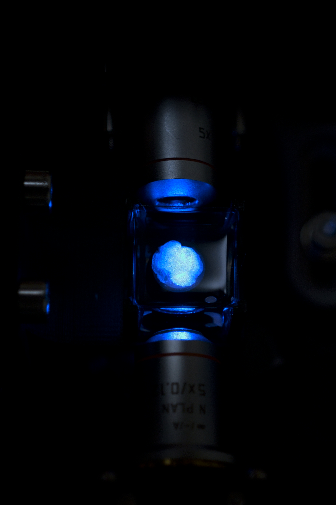

# Lightsheet

This repository contains everything needed to build and run the Bergeron Lab lightsheet microscope system.

The system is an "end-to-end solution". This means that we provide:

* Optics (Modified OpenSPIM design).
* Mounting Hardware.
* Stage Control System.
* Laser Control System.
* Camera Control System.
* Specimen Chamber.
* Easy to use GUI and PS4 Controller interface.
* Stack, Tiled and Time-lapse scan functions.

The goal of this system is to provide a low-cost, high-quality alternative to commercial lightsheet systems.
Our philosophy was "Do a small number of things really well". The goal was to make it very easy to take high quality scans while leaving any processing or analysis to other tools.
# Table of Contents
* [Assembly and Installation](#Assembly-and-Installation)
* [Standard Operating Procedure](#Standard-Operating-Procedure)
* [Troubleshooting](#troubleshooting)
* [Contact](#contact)
* [License](#license)


# Assembly and Installation

**Parts List:** [Click Here](https://docs.google.com/spreadsheets/d/18pRoh0PZBaclofkvuCLl1aGt24ObCIeX1hrV7fQlwLQ/edit?usp=sharing)


**Software Requirements**

Name | Version
------------ | -------------
[Windows 10](https://www.microsoft.com/en-ca/windows/get-windows-10) | Latest Version
[Anaconda](https://www.anaconda.com/) | Latest Version
Python | 3.6.9
[Spinnaker SDK](https://drive.google.com/file/d/1ekqroxbpQbD4XAP_PvaEMywXw5San4l4/view?usp=sharing) | 1.20.0.15
[Spinnaker Python](https://drive.google.com/drive/folders/1aErW7o_pc7jhp2hj4MuVE-I-7R72fGmS?usp=sharing) | 1.20.0.15
[Arduino IDE](https://www.arduino.cc/en/main/OldSoftwareReleases) | 1.6.9
OpenCV | 4.1.1.26
PySerial | 3.4
tifffile | 2018.10.18
pillow | 6.1.0
dask | 2.5.0
pygame | 1.9.6
scikit-image | 0.15.0

**Steps**

1. Start with a computer with Windows 10.

1. Download and install the most recent version of Anaconda from [here](https://www.anaconda.com/).

2. Download and install the Arduino IDE from [here](https://www.arduino.cc/en/main/OldSoftwareReleases).

5. Install the Spinnaker SDK using the executable installer provided [here](https://drive.google.com/file/d/1ekqroxbpQbD4XAP_PvaEMywXw5San4l4/view?usp=sharing). **Note:** If you don't want to trust this binary, you can email Flir and request the installer from them. Ask for the version specified in the dependencies table above.

5. Open Anaconda Prompt and create a virtual environment using this command ```conda create -n lightsheet python=3.6 ```

6. Enter the newly created environment using this command ```conda activate lightsheet```

7. Install OpenCV using the command ```pip install opencv-python```

8. Install PySerial using the command ```pip install pyserial```

9. Install tifffile using the command ```pip install tifffile```

10. Install pillow using the command ```pip install pillow```

11. Install dask[array] using the command ```pip install dask[array]```

12. Install pygame using the command ```pip install pygame```

13. Install scikit-image using the command ```pip install scikit-image```

14. Install the Spinnaker Python API by downloading [this]() folder and following the instructions in the README.txt contained within.

15. Upload ```./arduino/arduinoServer/arduinoServer.ino``` to your arduino mega.

16. Add ```./Lightsheet/src``` to your system path.

17. If everything above worked correctly, open a console and type ```run```. The system should start and greet you with a GUI.

# Standard Operating Procedure

## Important Warnings - Read First

1. Be careful to avoid getting contaminants on any optical components (This includes lenses, camera sensors, laser diodes, and any component in the optical stack). These components are expensive and quite sensitive to contaminants.

2. Avoid touching or applying force to any piece of the system unless explicitly required by the operating procedures outlined in this document. The optical stack needs to be precisely aligned for the microscope to function correctly. Care should be taken not to accidentally bump things. The list below shows the **only** components that need to be touched/used/adjusted during normal operating procedures:
  - Imaging objective thumb screw
  - Sample chamber thumb screw
  - Sample chamber
  - PS4 Controller


3. **Laser shutter:** Ensure laster shutter is closed prior to turning on the laser. It&#39;s a good habit to start any dangerous equipment from a safed position. Pressing &#39;O&#39; on the Playstation controller will toggle the laser shutter open and closed. Additionally, make sure the laser shutter is in the closed position prior to starting a scan.

4. **Tiling Function:** When using the tiling function, ensure the scan starts with the stage centered (0&#39;d in X and Y). The stage will run into the limit switches during the tiling procedure if you try to tile a grid too large or starting too far from X,Y=0. This _shouldn&#39;t_ damage anything, but will at the very least ruin your scan and could potentially damage something. **Note:** We can and should add a feature to automatically prevent tiled scans from starting if they don&#39;t have enough room to complete. We have stage position information already so it would only be a software feature.

5. **All Scans:**

  - The sample chamber will be moved upwards from it&#39;s starting position when acquiring an image stack. There is about 5mm of space between the top of the sample chamber and the cover glass. Make sure your stacks are not taller than this or the sample chamber and cover glass will collide. This will ruin your scan and potentially damage something. **Note:** To make this collision impossible we need to add a limit switch to the z-axis of the stage. Then we can zero it on startup and keep track of it&#39;s position with the stepper motors and prevent it from ever extending past 5mm in software.

  - Do not manually move the stage too far in either direction of the z-axis. This axis has no limit switches and it will happily keep going until it damages something.

  - Use the minimum laser power possible. If you get too much light scattering in your sample from outside the focal plane it will degrade image quality. It manifests as blurry streaks. Additionally, the laser will quickly break down your fluorophores, weakening your signal. Lower laser power will slow this process, prolonging the useful life of your sample.

## Refractometer

- See instruction manual.
- Clean the refractometer after each use.

## Setup Procedure (Perform In Order)

### **Laser Startup**

  1. Ensure the laser power dial is on lowest setting.

  2. Ensure the laser shutter is closed.

  3. Ensure TEC and LC power cables are both plugged into a surge protector.

  4. Push the TEC power button and set it to 19 celsius.

  5. Push the LC power button.

  6. Slowly turn the laser power up to your approximate desired power.

  7. Let the laser diode warm up and settle for ~10 minutes.

### **Stage and Motors**

  1. Ensure the power cable coming from the motor drivers is plugged into a surge protector.


### **Imaging Camera**

  1. Ensure the USB cable coming from the imaging camera is plugged into a USB 3.0 port on the back of the computer.


### **Control Electronics**

  1. Ensure the USB cable coming from the Arduino is plugged into any USB port on the back of the computer.


### **Software**

  1. Start the computer and sign in.

  2. Open the Anaconda prompt located on the windows taskbar.

  3. Type &quot;run&quot; and hit enter.

  4. The software will take a few seconds to start. A fullscreen GUI will open with a live preview showing what the imaging sensor sees. A message in the console window embedded in the bottom of the GUI will show &quot;Startup complete! Ready to scan!&quot; when startup has completed.

  5. The PS4 controller and GUI are now active and can be used to control the microscope.

### **Sample Chamber Prep**

  1. Prepare approximately 100ml of imaging solution. Adjust RI and check with Abbe refractometer.

  2. Make sure that the lateral walls of the chamber are clean and free of oil smudges, DO NOT touch the glass with bare hands. If glass is dirty, soak the entire chamber in 100% ethanol (70% is not enough to thoroughly clean oil smudges. Wipe the glass with Kimwipe, then check under a light for smudges, repeat if needed. Smudges will refract the imaging laser and result in sub-optimal scans.

  3. Clean the sample chamber cover with 100% ethanol, check for smudges, clean with kimwipe and repeat if needed.

  4. Fill sample chamber with RI adjusted imaging solution to 90% final volume (to account for increase in volume after inserting the sample holder + sample.

  5. Place chamber onto chamber holder and tighten thumb screw to lock in place.

### **Sample Mounting:**

  1. Empty contents of sample tube into a clean glass petri dish, then use a pipette to remove the clearing solution and place back into the sample tube. (clearing solution can be toxic, work under ventilated conditions.)

  2. Scoop up the sample and place on a clean filter paper, remove the olfactory bulbs and cerebellum with a clean scalpel.

  3. Flip the sample on to its medial surface, then use a scalpel to remove part of the ventral region of the sample so that the midline of the brain (with the ventral surface pointing down, and the medial surface pointing right or left, depending on the hemisphere being imaged) is close to parallel with the light sheet.

  4. Place the sample on the sample holder, place a bead of silicone around the base of the sample to hold it in place, this ring of silicone can be reused for the next sample as it does not bind to the tissue.

  5. Bring the 3-axis stage close to the sample chamber. Secure the sample holder onto the 3-axis stage by tightening the screw gently by hand (indicated by &quot;4&quot; on reference image1), adjust the height if necessary so that the dorsal surface of the brain is in the laser path. (Do not over tighten the screw, it is not necessary). The sample should now be sitting inside the sample chamber, the laser path should be closed to avoid photobleaching.

  6. Carefully place the glass cover on top of the sample chamber, the center of the cover glass should line up with the center of the imaging objective.

  7. Using a pipette, fill the sample chamber with the imaging solution until the surface tension is able to completely cover the bottom of the glass cover.

### **Image Focus/Setup**

  1. Lower the imaging objective by loosening the thumb screw (indicated by &quot;2&quot; in reference image1), the distance from the imaging objective to the glass cover depends on the objective being used, for 2.5x it should be less than 1cm. DO NOT get oil on the objective.

  2. For one sided projection, bring the left projection objective (5x) as close as possible to the glass wall of the sample chamber without touching (DO NOT get oil on the projection objective), the other laser path should be blocked. For dual projection, repeat these steps and open the second laser path.

  3. Use the appropriate filter for the laser.

  4. While looking at the live view on screen, open the laser path by pressing &quot;O&quot; on the playstation controller. Move the sample into the laser path using the Z axis joystick on the controller. There should be signals on the screen at this point, adjust the focus with the micromanipulator on the imaging objective (indicated by &quot;3&quot; on reference image1).

  5. Adjust laser power to increase signal strength, the smallest vessels should be brightly lit.

  6. Adjust the focus of the light sheet if needed, this is done through moving the first of the telescopic pair right before the projection objective (indicated by &quot;1&quot; on reference image1). The focus of the light sheet can be seen changing on the live view, keep the thinnest part of the lightsheet in the middle of the screen.

  7. Decide if you are doing single stack or tiled imaging.

  8. If you are doing tiled imaging, the stage will move in a zig-zag pattern from the top left corner starting from the FOV you are looking at, so make sure to set the top left corner of the ROI as the starting point.

  9. If doing tiled scans, move the entire stage by hand to move the sample into the starting location. The range of travel for the stage is about 11mm in each direction, if there isn&#39;t enough room for the stage for all the tiles, then it will hit a limit switch and return to the home position during the scan, which will ruin the tiles.

  10. Check the depth of the stack by multiplying the number of slices by step size, this number should be smaller than 4mm (4000 micron). The sample will move up during th1e scan, and eventually hit the cover glass if it moves up too far.

  11. Adjust the laser power prior to scanning, use the minimum laser power possible to achieve sufficient signal strength, more is not better. Scattering due to high laser power will cause smearing artifacts in the scan.

  12. When you are ready to scan, return the sample to the starting position in the Z axis (top of the sample), block the laser path by pressing &quot;O&quot; on the controller.

  13. Press &quot;stack scan&quot; or &quot;tiled scan&quot; on the computer. The laser path will open automatically, and the Z axis will begin to move, make sure there is signal on the screen before going away.

  14. If you want to rescan a sample, make sure to delete the old file first, or give it a unique name.

  15. Check and make sure there is enough room on the harddrive before starting a scan, as the scans can be large. If there isn&#39;t enough room then move it onto a portable harddrive first.

  16. After each scan, move the imaging objective up and out of the way so the sample holder can be removed. This will prevent accidental exposure of the imaging objective to the imaging solution.

  17. Carefully remove the sample holder to not drip imaging solution on any part of the microscope optics. It can help to move the entire 3 axis stage toward you, as it isn&#39;t screwed into the body of the objective.


# Troubleshooting

**Why is there no signal in the scans?**

- Was the laser path closed prior to the start of the scan? (This is controlled by the servo, and can be engaged by pressing &quot;O&quot; on the controller. Failure to do this will result in the laser shutter closing the path during the scan.
- Was the correct filter used?
- Was the sample in the correct position prior to the start of a scan? It needs to start from the top left corner for a tiled scan.

**Why is there no signal in the liveview?**

- Was the correct filter used?
- Is the correct laser used for the fluorophore?
- Is the camera plugged in? If it is then restart the program.
- Sometimes there is no signal due to bad sample preparation (injection, viral infection, staining etc.)

**Why is the stage not moving?**

- Is the playstation controller plugged in? Check that the cable is intact.
- Is the power supply for the motor drivers plugged in?
- Is the arduino plugged into the computer?
- If all of the above has been done, try restarting the program, and/or the computer.

**Why is the signal in 3D reconstruction blurry (streaking)?**

- Most likely due to incomplete clearing of the tissue. The light sheet will scatter as it enters the tissue and creates out of focus light.
- Is the lightsheet focused? The projection objective should be as close to the chamber as possible. If focusing issues remain, move the telescopic lens behind the projection objective until focus is achieved (indicated by &quot;1&quot; on reference image1).

**Why is there &quot;ghosting&quot; in the 3D reconstruction?**

- If you see two copies of the same vessel stacked vertically, it is due to the same location being excited by the laser twice. This can occur in both single and dual lumination modes. In single laser imaging, there can be a mismatch in the refractive index between the imaging solution and the sample, causing the laser to bend and it hits the sample, sometimes causing the same location in the sample to be excited twice. In dual laser imaging, this most commonly occurs due to misalignment of the two light sheets.

**Why is the sample moving in the live view?**

- The sample isn&#39;t glued down to the sample holder, it is held by a ring of silicone, which needs to be snug against the wall of the sample, if the sample is sitting on top of the silicone ring, or if the sample is too small, it will not be held in place and start moving very slightly during the scan, creating problems for reconstruction later.
- If you have chosen a scan depth that is too large, as the scan reaches the end of the stack, the top of the sample will come into contact with the glass cover.

# Gallery




# Contact
* [Boyang Wang](jwang149@gmail.com)
* [Julian Pitney](www.julianpitney.com)

# License
This repository and all it's contents are property of the Bergeron Lab.
